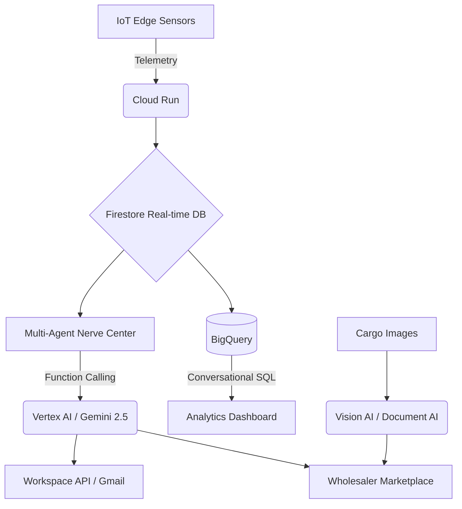

  
  
   
  
  <h1>Annapurna Logistics 🏔️</h1>
  
  

    <strong>Built for Google Cloud Gen AI Academy APAC</strong> 
    <em>Minimizing waste. Maximizing efficiency. Saving the harvest.</em>
  

  
  

    <a href="#the-15-lakh-crore-crisis">The Problem</a> •
    <a href="#our-autonomous-solution">Our Solution</a> •
    <a href="#key-features">Key Features</a> •
    <a href="#architecture">Google Cloud Stack</a>
  

---

## 💔 The ₹1.5 Lakh Crore Crisis

Every year, India loses over **₹1.5 Lakh Crore** to food wastage. The primary culprit? **Broken, fragmented logistics and compromised cold-chain integrity.**

Traditional logistics fleets operate with blind spots. Drivers face unpredictable weather, severe traffic, and mechanical failures. By the time a refrigeration compressor fails on a transport truck, the damage is already done. The cargo spoils, the farmer loses their livelihood, and the wholesaler receives nothing. The current market relies on reactive telematics—telling managers a truck *has already broken down*. 

## 💡 Our Autonomous Solution

**Annapurna** is an autonomous, multi-agent logistics ecosystem designed to eradicate food waste in transit. 

We don't just track trucks; we actively protect perishables. By combining **Google Cloud IoT Edge Telemetry** with **Gemini 2.5 Multi-Agent Orchestration**, Annapurna continuously monitors environmental conditions. If our hardware detects a cooling failure, our AI autonomously calculates reroutes, alerts drivers in their native language, and opens an emergency bidding marketplace to sell the endangered cargo before it spoils.

---

## ✨ Key Features (Google Cloud Gen AI Innovations)

### 1. Multi-Agent Orchestration on Google Vertex AI (The Nerve Center)
Instead of a simple chatbot, Annapurna is powered by a distributed Multi-Agent System hosted on **Vertex AI**. 
*   **MonitorAgent:** Analyzes real-time IoT edge telemetry (Temp, Humidity, GPS) ingested via **Google Cloud Run**.
*   **DecisionAgent:** Powered by **Vertex AI** and **Gemini 2.5 Function Calling** to autonomously calculate reroutes and evaluate spoilage windows when anomalies are detected.
*   **NotificationAgent:** Integrates with the **Google Workspace API** to dispatch automated Gmail alerts to managers and push distressed cargo data directly into the marketplace.

### 2. Multi-Modal Vision & Google Document AI
At delivery checkpoints, quality control is completely automated. We utilize **Gemini 1.5 Pro's Multi-modal Vision capabilities** (via Vertex AI) to scan physical cargo images and instantly detect rot, mold, or spoilage percentages. Simultaneously, **Google Document AI** OCR pipelines instantly digitize physical transport invoices and weighbridge receipts, eliminating manual B2B data entry.

### 3. Conversational Analytics with Google BigQuery & Predictive AI
We transformed our data warehouse into a conversational engine. Fleet managers can type plain English queries (e.g., *"Which trucks spoiled this week?"*). The Gemini model translates this into exact SQL syntax, queries our **Google BigQuery** data lake, and renders beautiful, real-time predictive forecast charts. We've heavily integrated **Vertex AI Predictive Modeling** to forecast future ESG Metrics (CO2 prevented, Farmers' revenue saved) and predict future spoilage based on historical climate data.

### 4. Voice AI & Localization via Dialogflow CX
To support diverse drivers across rural India, we integrated a **Google Dialogflow CX Voice widget** backed by the **Google Cloud Translation API**. This allows drivers to interact with cutting-edge AI dispatchers entirely via voice in regional languages like Hindi, Marathi, and Tamil. 

### 5. The Emergency Wholesaler Marketplace (Powered by Firestore)
When a cold-chain failure is unavoidable, the AI pushes the distressed cargo to a live, geo-fenced smart marketplace built on **Google Cloud Firestore**. Nearby wholesalers can bid on the cargo instantly in real-time. Firestore's low-latency syncing ensures the food is rescued rapidly, and economic value is recovered for the farmers.

---

## ⚙️ The Google Cloud Stack Architecture

Annapurna is built for enterprise scale, utilizing the full breadth of the **Google Cloud ecosystem** for extreme reliability and AI intelligence.

*   **Compute:** Google Cloud Run (Serverless, auto-scaling microservices)
*   **AI/ML Engine:** Google Vertex AI (Gemini 2.5, Gemini 1.5 Pro Vision, Predictive AI)
*   **Databases:** Google Firestore (Real-time marketplace syncing) & Google BigQuery (Enterprise Data Lake for analytics)
*   **Applied AI:** Google Document AI (Invoice OCR) & Dialogflow CX (Voice bots)
*   **Integrations:** Google Workspace APIs (Gmail alerts), Cloud Translation API (Vernacular localization)

  

 

*Live map navigation and intelligent rerouting directly to the driver.*

  

### 🤝 The Wholesaler Marketplace
*A revolutionized B2B market. Wholesalers are notified of emergency cargo nearby and can bid to save the load.*

  
  

---

## 📸 Latest Application Screenshots

*Showcasing our newest features: The Nerve Center, Predictive Analytics, and Live Dashboard.*

  
  
  
  
  
  
  
  
  
  
  
  

---

  <h3>Ready to revolutionize your supply chain?</h3>
  
Join industry leaders in minimizing waste and maximizing efficiency with Annapurna's AI logistics platform built on Google Cloud.

