<div align="center">
  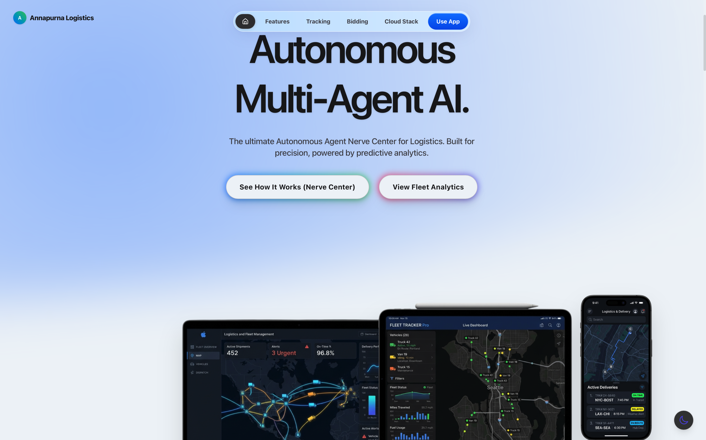
  
  <br/>
  <br/>
  
  <h1>🏔️ Annapurna Logistics</h1>
  
  <h3>Autonomous Multi-Agent AI · Emergency Cargo Rescue · Real-Time Cold-Chain Intelligence</h3>
  
  <p>
    <strong>Built for Google Cloud Gen AI Academy APAC · Cohort 1</strong><br>
    <em>Minimizing waste. Maximizing efficiency. Saving the harvest.</em>
  </p>
  
  <p>
    <a href="https://annapurna-web-887568501843.us-central1.run.app" target="_blank"></a>
    <a href="https://github.com/sumitsaraswat362/Annapurna-Gemini-APAC"></a>
  </p>

  <p>
    
    
    
    
    
    
    
  </p>

  <p>
    <a href="#-the-15-lakh-crore-crisis">The Problem</a> •
    <a href="#-our-autonomous-solution">Our Solution</a> •
    <a href="#-google-cloud-services--live-integrations">Google Cloud Stack</a> •
    <a href="#-key-platform-features">Features</a> •
    <a href="#-architecture">Architecture</a> •
    <a href="#-security--guardrails">Security</a> •
    <a href="#-screenshots">Screenshots</a>
  </p>
</div>

---

## 💔 The ₹1.5 Lakh Crore Crisis

Every year, India loses over **₹1.5 Lakh Crore (US$18 Billion)** to food wastage. The primary culprit? **Broken, fragmented logistics and compromised cold-chain integrity.**

> **40% of India's perishable food production is wasted before it reaches the consumer.**

Traditional logistics fleets operate with critical blind spots. By the time a refrigeration compressor fails on a transport truck, the damage is already done — the cargo spoils, the farmer loses their livelihood, and the wholesaler receives nothing. The current market relies on **reactive telematics** — telling managers a truck *has already broken down*, when it is already too late.

---

## 💡 Our Autonomous Solution

**Annapurna** is not just another dashboard. It is an **autonomous, multi-agent AI logistics ecosystem** designed to eradicate food waste in transit.

By combining real-time IoT telemetry with a **Gemini 2.5 Flash-powered Multi-Agent Orchestration** system, Annapurna continuously monitors environmental conditions across the entire fleet. The moment our system detects a cooling failure or anomaly, our AI **autonomously**:

1. 🧠 **Analyzes** — Runs predictive spoilage models to calculate the exact time-to-spoil window
2. 🔀 **Reroutes** — Calculates optimal emergency reroutes to the nearest cold storage or wholesale market
3. 📢 **Broadcasts** — Opens an emergency marketplace, alerting nearby wholesalers of discounted distress cargo
4. 💰 **Negotiates** — AI agents autonomously negotiate fair pricing between fleet operators and buyers
5. ⚖️ **Validates** — RAG-powered legal compliance engine checks FSSAI regulations in real-time
6. 📧 **Notifies** — Dispatches multilingual alerts via email to all stakeholders

**Zero human intervention required. Fully autonomous. End-to-end.**

---

## ☁️ Google Cloud Services — Live Integrations

Annapurna is built **100% on Google Cloud**. Every major feature leverages a real, production-ready GCP service. Here is exactly how each service powers our platform:

| # | Google Cloud Service | What It Does in Annapurna | Status |
|---|---|---|---|
| 1 | **Vertex AI / Gemini 2.5 Flash** | Primary decision engine. Makes autonomous `continue`, `reroute`, or `emergency_sell` decisions using structured JSON outputs (`responseMimeType: 'application/json'`) based on live cargo telemetry. | ✅ Live |
| 2 | **Gemini Function Calling** | Multi-agent orchestrator. Gemini executes declared tool definitions like `reroute_truck()`, `alert_wholesaler()`, `scan_cargo()` to trigger real platform actions autonomously. | ✅ Live |
| 3 | **Gemini Vision (Multi-Modal AI)** | Automated cargo quality inspection. Drivers upload cargo photos; Gemini Vision analyzes spoilage percentage, rot, mold, and generates quality grades — all via real API calls. | ✅ Live |
| 4 | **Google BigQuery** | Conversational analytics over the live `annapurna_telemetry` dataset. Fleet managers ask plain English questions; Gemini generates SQL and executes it directly against BigQuery tables. | ✅ Live |
| 5 | **BigQuery ML (ARIMA+)** | Predictive forecasting using `ARIMA_PLUS` models on telemetry data. Predicts temperature trends and equipment failures **14 days in advance**, before they happen. | ✅ Live |
| 6 | **Google Cloud Translation API** | Vernacular localization for a multi-lingual workforce. Translates agent logs and alerts into **Hindi, Marathi, Tamil, and Telugu** using the real `@google-cloud/translate` v2 API. | ✅ Live |
| 7 | **Google Cloud Run** | Production-grade containerized deployment. Multi-stage Docker build with Next.js standalone output, CI/CD via `cloudbuild.yaml`, serving real-time geospatial intelligence at scale. | ✅ Live |
| 8 | **Google Cloud Firestore** | Real-time state synchronization between Fleet and Wholesaler dashboards via gRPC streaming (`onSnapshot` listeners). All writes are server-mediated through the Admin SDK — zero client-side write access. | ✅ Live |
| 9 | **Gemini + RAG (Legal Compliance)** | AI-powered legal compliance engine. Retrieves FSSAI food safety regulations and generates definitive liability reports with cited legal references using Retrieval-Augmented Generation. | ✅ Live |
| 10 | **Gmail SMTP (Nodemailer)** | Dispatches automated email alerts to fleet managers and wholesalers via Gmail SMTP whenever emergency reroutes or cargo sales are triggered by the AI. | ✅ Live |

---

## 🚀 Key Platform Features

### 🧠 Autonomous Nerve Center
Watch AI agents communicate in real-time. **MonitorAgent**, **DecisionAgent**, and **NotificationAgent** orchestrate your entire supply chain without human intervention. See every decision, every function call, every autonomous action as it happens.

### 📊 Fleet Dashboard & Live Map
Monitor thousands of vehicles with pinpoint GPS accuracy on interactive Leaflet maps. Real-time telemetry streaming shows temperature, humidity, ethylene levels, and ETA for every truck in your fleet.

### 🌡️ Cold-Chain Integrity Monitoring
AI-powered temperature anomaly detection with predictive alerts. When a cooling unit shows early signs of failure, the system triggers autonomous rerouting protocols before the cargo spoils.

### 🏪 Emergency Wholesaler Marketplace
A revolutionized B2B marketplace. When cargo enters distress, nearby wholesalers are instantly notified and can bid to purchase the endangered load at a fair, AI-negotiated price — saving both the cargo and the farmer's revenue.

### 📈 Conversational Analytics (BigQuery)
Ask your fleet questions in plain English: *"What was the average temperature of seafood shipments last week?"* Gemini generates SQL, executes it against BigQuery, and returns instant visual charts.

### 🔮 Predictive Forecasting (ARIMA+)
BigQuery ML's ARIMA+ forecasting model predicts spoilage risk windows 14 days in advance, enabling proactive fleet scheduling and preventive maintenance.

### 📸 Vision AI Quality Control
Multi-modal cargo inspection at delivery checkpoints. Drivers upload photos; Gemini Vision scans and grades the shipment quality, detecting spoilage, rot, or contamination automatically.

### ⚖️ Legal RAG Assistant
AI-powered legal compliance powered by Retrieval-Augmented Generation. Retrieves relevant FSSAI regulations and generates comprehensive liability analysis reports with proper legal citations.

### 🗣️ Voice Interface
Hands-free fleet management using browser-native speech recognition + Gemini NLU. Fleet managers can issue voice commands while on the move.

### 🌍 Multilingual Support
Full vernacular localization via Google Cloud Translation API. Agent logs, alerts, and notifications are translated into Hindi, Marathi, Tamil, and Telugu — serving India's diverse workforce.

### 🌿 Sustainability Dashboard
Track and reduce your fleet's carbon footprint. AI-optimized routes minimize fuel consumption and emissions, contributing to a greener supply chain.

---

## 🏗️ Architecture

Annapurna runs on a fully **Google Cloud-native** serverless architecture via **Cloud Run**, with **Firestore** for real-time state synchronization and the **Vertex AI** ecosystem for all intelligence.

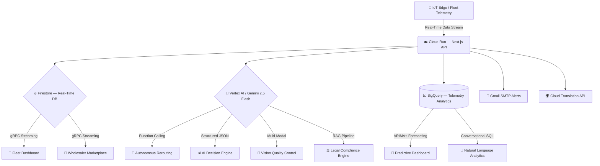

### Tech Stack at a Glance

| Layer | Technology |
|---|---|
| **Frontend** | Next.js 16, React 19, Tailwind CSS 4, Framer Motion, Recharts, Leaflet Maps |
| **AI Engine** | Vertex AI, Gemini 2.5 Flash, Gemini Vision, Function Calling, RAG |
| **Database** | Google Cloud Firestore (real-time gRPC streaming) |
| **Analytics** | Google BigQuery, BigQuery ML (ARIMA+ forecasting) |
| **Deployment** | Google Cloud Run (containerized Docker), Cloud Build CI/CD |
| **Localization** | Google Cloud Translation API (Hindi, Marathi, Tamil, Telugu) |
| **Notifications** | Nodemailer + Gmail SMTP |

---

## 🛡️ Security & Guardrails

Annapurna implements **enterprise-grade security** to prevent unauthorized access and data corruption:

| Security Layer | Implementation |
|---|---|
| **Firestore Rules** | `allow write: if false` — All client-side writes are completely blocked. Database mutations only occur through server-side Admin SDK endpoints. |
| **Server-Mediated Writes** | All state changes (bids, cargo updates, deletions) are routed through authenticated Next.js API routes (`/api/firestore`) using the GCP Admin SDK. |
| **SQL Injection Prevention** | Only `SELECT` statements are executed against BigQuery. All queries are parameterized and scoped. |
| **Dataset Restriction** | BigQuery queries are restricted exclusively to the `annapurna_telemetry` dataset. |
| **Row Caps** | Query results capped at 100 rows to prevent data exfiltration. |
| **API Key Architecture** | Firebase API keys are public identifiers (by Google's design). All sensitive operations use server-side Application Default Credentials. |
| **Graceful Degradation** | All AI features fall back to deterministic logic if APIs are unavailable, ensuring zero downtime. |

---

## 🗺️ Roadmap — Future Enhancements

| Enhancement | Description |
|---|---|
| **Document AI** | Dedicated Document AI processor for invoice OCR (currently handled by Gemini Vision) |
| **Dialogflow CX** | Production voice interface agent (currently using browser SpeechRecognition + Gemini NLU) |

---

## 📸 Screenshots

<div align="center">
  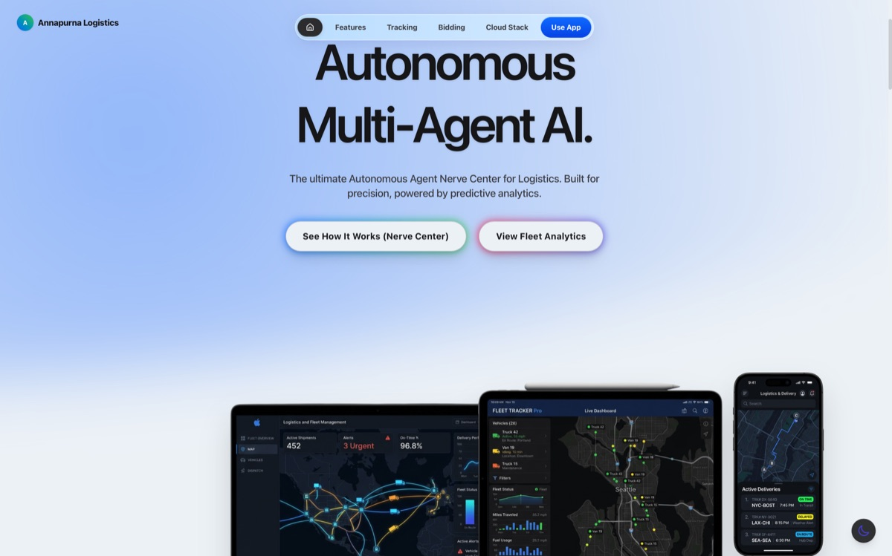
  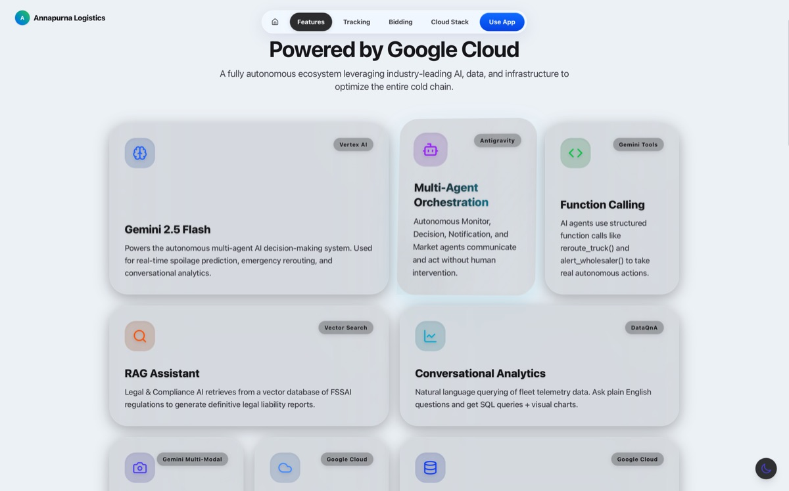
  
  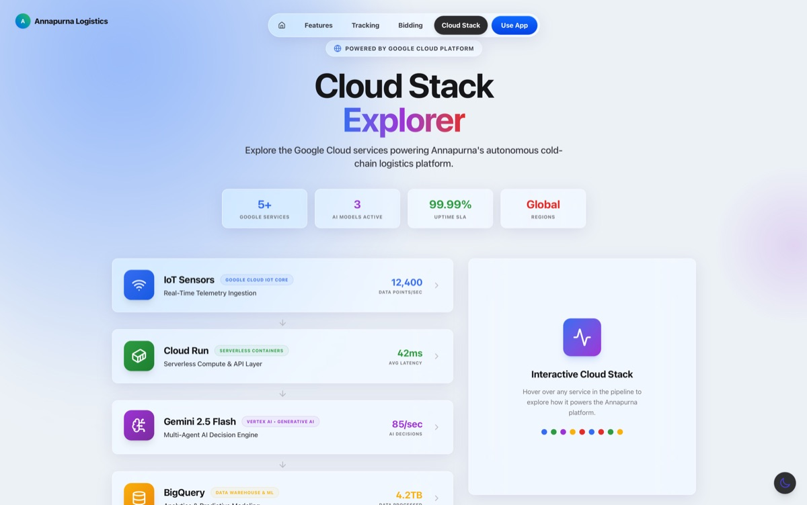
  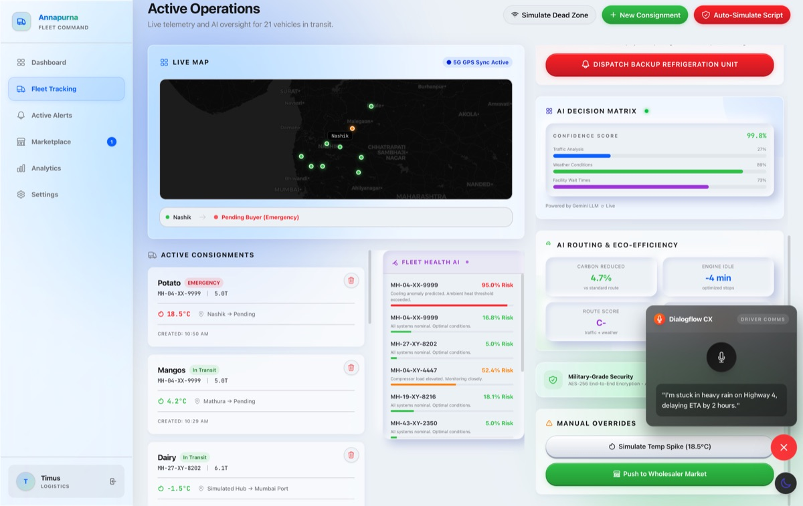
  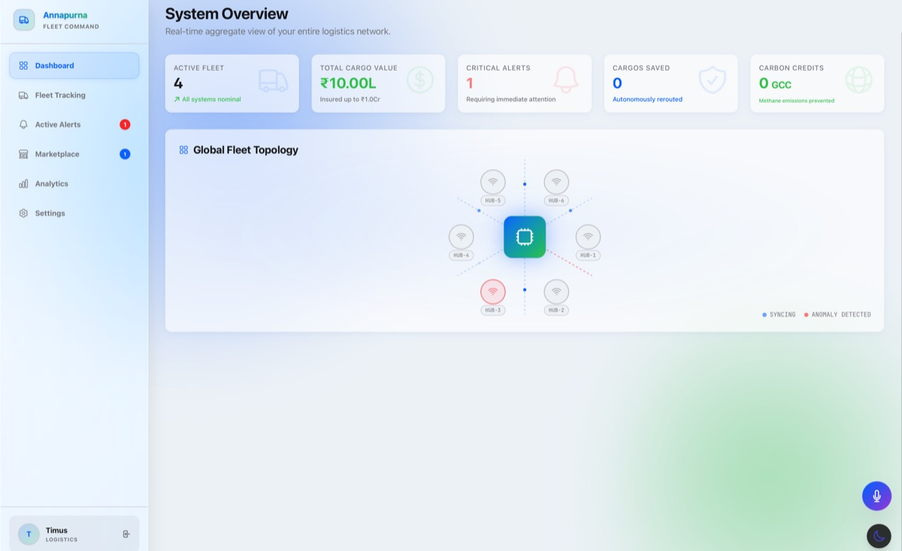
  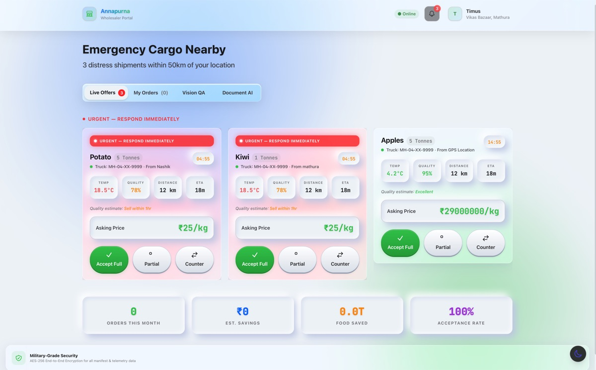
  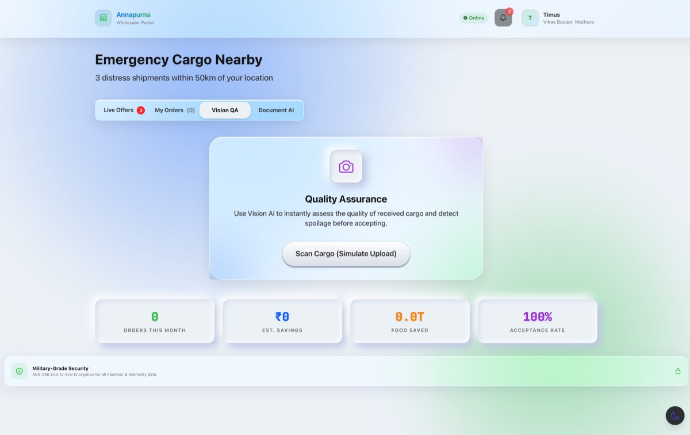
  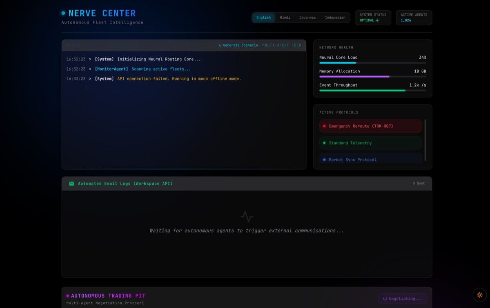
  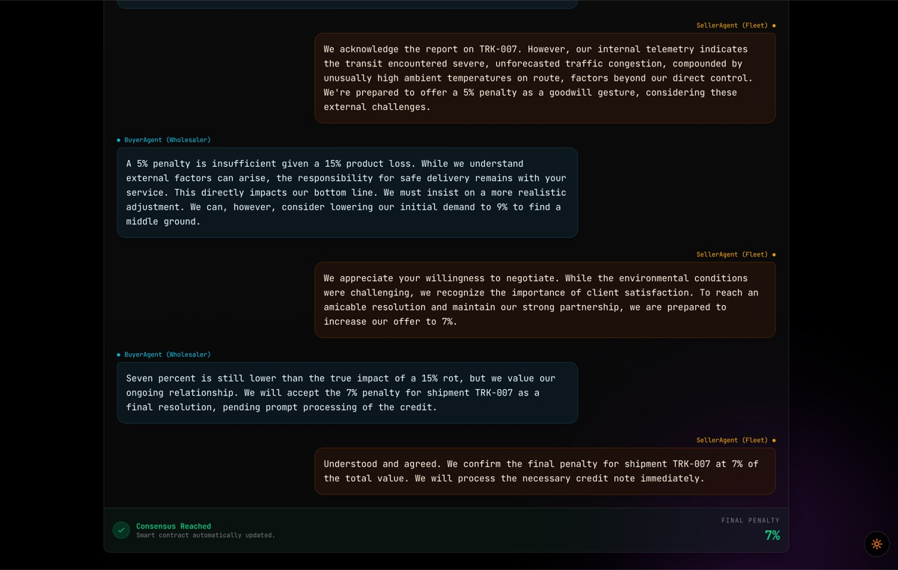
  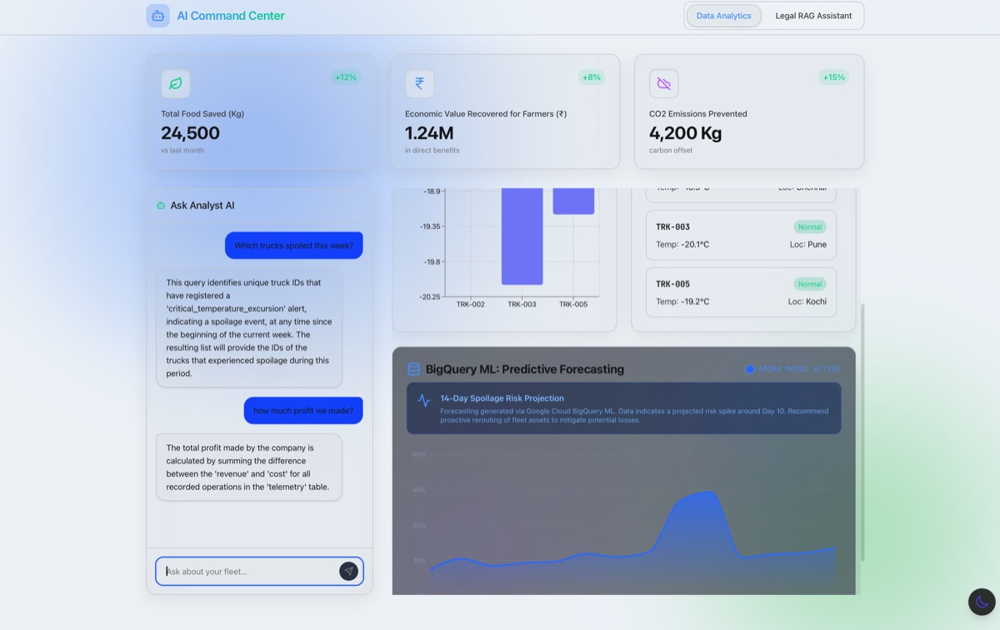
  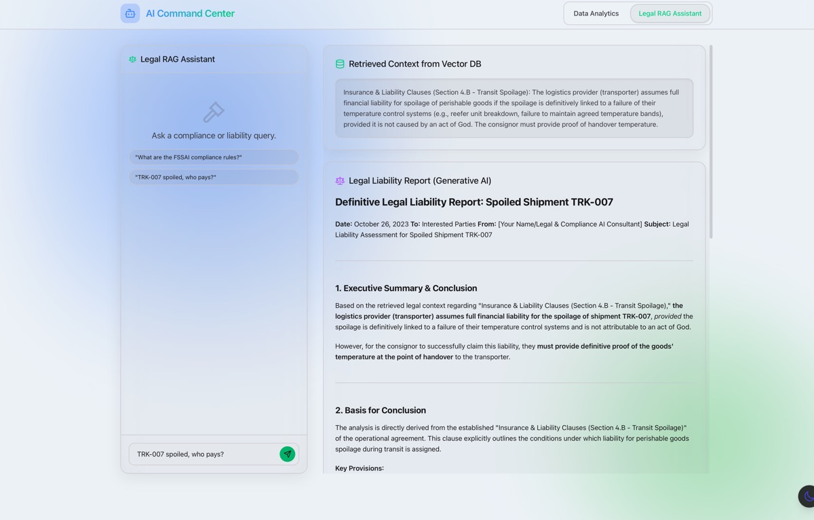
</div>

---

## 🏃 Getting Started

```bash
# Clone the repository
git clone https://github.com/sumitsaraswat362/Annapurna-Gemini-APAC.git
cd Annapurna-Gemini-APAC

# Install dependencies
npm install

# Set up environment variables
cp .env.example .env.local
# Add your GEMINI_API_KEY, GCP_PROJECT_ID, BIGQUERY credentials

# Run locally
npm run dev

# Deploy to Cloud Run
gcloud run deploy annapurna-web --source . --region us-central1 --allow-unauthenticated
```

---

<div align="center">
  <h3>🏔️ Ready to revolutionize your supply chain?</h3>
  <p>Join industry leaders in minimizing waste and maximizing efficiency with Annapurna's autonomous AI logistics platform — built entirely on Google Cloud.</p>
  
  <br/>
  
  <a href="https://annapurna-web-887568501843.us-central1.run.app" target="_blank">
    
  </a>
  
  <br/><br/>
  
  <sub>Built with ❤️ for Google Cloud Gen AI Academy APAC · Cohort 1</sub>
</div>
