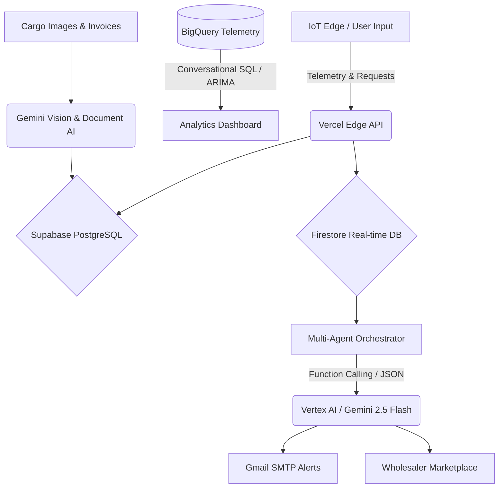

  
  
   
  
  <h1>Annapurna Logistics 🏔️</h1>
  
  

    <strong>Built for Google Cloud Gen AI Academy APAC</strong> 
    <em>Minimizing waste. Maximizing efficiency. Saving the harvest.</em>
  

  
  

    <a href="#the-15-lakh-crore-crisis">The Problem</a> •
    <a href="#our-autonomous-solution">Our Solution</a> •
    <a href="#key-features--live-integrations">Key Features</a> •
    <a href="#roadmap--planned-integrations">Roadmap</a> •
    <a href="#guardrails--safety">Guardrails & Safety</a> •
    <a href="#the-architecture-vercel--google-cloud">Tech Stack</a>
  

  

    
    
    
    
    
  

---

## 💔 The ₹1.5 Lakh Crore Crisis

Every year, India loses over **₹1.5 Lakh Crore** to food wastage. The primary culprit? **Broken, fragmented logistics and compromised cold-chain integrity.**

Traditional logistics fleets operate with blind spots. By the time a refrigeration compressor fails on a transport truck, the damage is already done. The cargo spoils, the farmer loses their livelihood, and the wholesaler receives nothing. The current market relies on reactive telematics—telling managers a truck *has already broken down*. 

## 💡 Our Autonomous Solution

**Annapurna** is an autonomous, multi-agent logistics ecosystem designed to eradicate food waste in transit. 

By combining real-time telemetry with a **Gemini-powered Multi-Agent Orchestration** system, Annapurna continuously monitors environmental conditions. If our system detects a cooling failure, our AI autonomously calculates reroutes, alerts managers in their native language, and opens an emergency bidding marketplace to sell the endangered cargo before it spoils.

---

## ✨ Key Features & Live Integrations

Annapurna is powered by real, production-ready Google Cloud APIs and modern database services:

### 1. Vertex AI / Gemini 2.5 Flash (Primary Decision Engine) ✅
The core intelligence of Annapurna. It makes autonomous `continue`, `reroute`, or `emergency_sell` decisions based on live cargo telemetry using structured JSON outputs (`responseMimeType: 'application/json'`).

### 2. Gemini Function Calling (Multi-Agent Orchestrator) ✅
Our orchestrated multi-agent system leverages Gemini with declared tool definitions, executing function calls like `reroute_truck()` and `alert_wholesaler()` to trigger real platform actions autonomously.

### 3. Gemini Vision (Cargo Quality Inspection) ✅
Automated multi-modal quality inspection via real API calls. Drivers upload cargo photos, and Gemini Vision scans the image to analyze spoilage percentages, rot, or mold.

### 4. Google BigQuery (Conversational Analytics) ✅
Real conversational analytics over the live `annapurna_telemetry` dataset. Fleet managers ask plain English questions; Gemini generates SQL and executes it directly against BigQuery tables.

### 5. BigQuery ML (Predictive Forecasting) ✅
Utilizes BigQuery ML's `ARIMA_PLUS` forecasting model on telemetry data to predict temperature trends and potential equipment failures before they happen.

### 6. Google Cloud Translation API (Vernacular Localization) ✅
Supports a multi-lingual workforce by translating agent logs and alerts into Hindi, Marathi, Tamil, and Telugu using the real `@google-cloud/translate` v2 API.

### 7. Supabase PostgreSQL (Relational Database & State) ✅
Provides a robust PostgreSQL backend handling secure user authentication, complex cargo tracking states, and persistent marketplace transactions.

### 8. Nodemailer + Gmail SMTP (Automated Alerts) ✅
Dispatches automated email alerts to fleet managers and wholesalers via Gmail SMTP whenever emergency reroutes or sales are triggered.

---

## 🗺️ Roadmap — Planned Integrations

We maintain full transparency regarding upcoming platform enhancements:

- **Google Cloud Firestore**: State management currently handled by Supabase; Firestore planned for real-time sync
- **Document AI**: Currently using Gemini Vision for OCR; dedicated Document AI processor planned
- **Dialogflow CX**: Voice interface uses browser SpeechRecognition + Gemini NLU; Dialogflow CX planned for production
- **Cloud Run**: Currently deployed on Vercel; Cloud Run migration planned for GCP-native deployment

---

## 🛡️ Guardrails & Safety

Annapurna implements enterprise-grade safety and security mechanisms to prevent unexpected behavior and data leakage:

- **SQL Injection Prevention**: Only SELECT statements are executed against BigQuery
- **Dataset Restriction**: Queries are restricted to the annapurna_telemetry dataset
- **Row Caps**: Query results capped at 100 rows
- **API Key Security**: All credentials stored as environment variables, never committed
- **Graceful Degradation**: All AI features fall back to deterministic logic if APIs are unavailable

---

## ⚙️ The Architecture (Vercel + Google Cloud)

Annapurna runs on a modern serverless edge architecture via **Vercel**, leveraging the full breadth of the **Google Cloud ecosystem** for extreme reliability and AI intelligence.

  

 

*Live map navigation and intelligent rerouting directly to the driver.*

  

### 🤝 The Wholesaler Marketplace
*A revolutionized B2B market. Wholesalers are notified of emergency cargo nearby and can bid to save the load.*

  
  

---

## 📸 Latest Application Screenshots

*Showcasing our newest features: The Nerve Center, Predictive Analytics, and Live Dashboard.*

  
  
  
  
  
  
  
  
  
  
  
  

---

  <h3>Ready to revolutionize your supply chain?</h3>
  
Join industry leaders in minimizing waste and maximizing efficiency with Annapurna's AI logistics platform built on Google Cloud.

