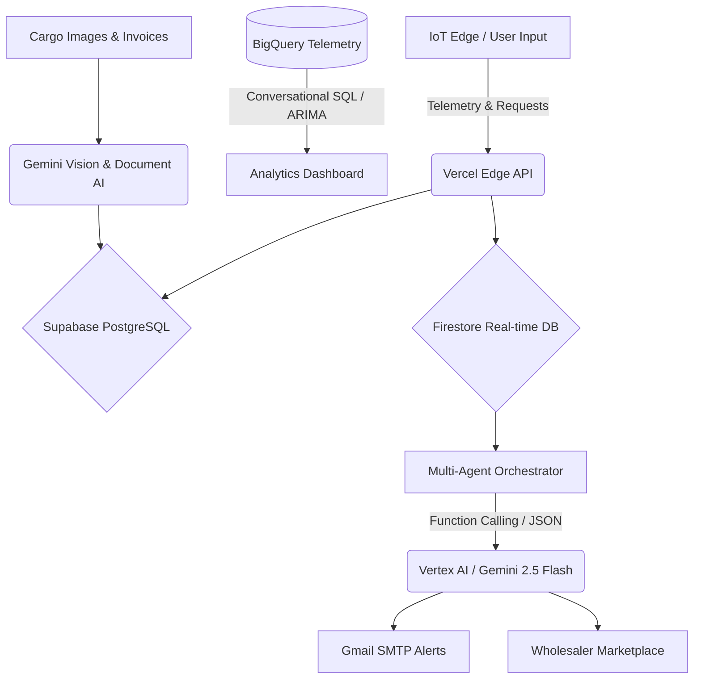

  
  
   
  
  <h1>Annapurna Logistics 🏔️</h1>
  
  

    <strong>Built for Google Cloud Gen AI Academy APAC</strong> 
    <em>Minimizing waste. Maximizing efficiency. Saving the harvest.</em>
  

  
  

    <a href="#the-15-lakh-crore-crisis">The Problem</a> •
    <a href="#our-autonomous-solution">Our Solution</a> •
    <a href="#key-features">Key Features</a> •
    <a href="#architecture">Tech Stack</a>
  

  

    
    
    
    
  

---

## 💔 The ₹1.5 Lakh Crore Crisis

Every year, India loses over **₹1.5 Lakh Crore** to food wastage. The primary culprit? **Broken, fragmented logistics and compromised cold-chain integrity.**

Traditional logistics fleets operate with blind spots. By the time a refrigeration compressor fails on a transport truck, the damage is already done. The cargo spoils, the farmer loses their livelihood, and the wholesaler receives nothing. The current market relies on reactive telematics—telling managers a truck *has already broken down*. 

## 💡 Our Autonomous Solution

**Annapurna** is an autonomous, multi-agent logistics ecosystem designed to eradicate food waste in transit. 

By combining real-time telemetry with a **Gemini-powered Multi-Agent Orchestration** system, Annapurna continuously monitors environmental conditions. If our system detects a cooling failure, our AI autonomously calculates reroutes, alerts managers in their native language, and opens an emergency bidding marketplace to sell the endangered cargo before it spoils.

---

## ✨ Key Features & Real Integrations

Annapurna is built with **9 real, verifiable Google Cloud and communication integrations**, alongside a robust modern database layer.

### 1. Vertex AI / Gemini 2.5 Flash (Primary Decision Engine)
The core intelligence of Annapurna. It makes autonomous `continue`, `reroute`, or `emergency_sell` decisions based on live cargo telemetry. We utilize structured JSON outputs (`responseMimeType: 'application/json'`) to ensure reliable and strictly formatted AI responses.

### 2. Gemini Function Calling (Multi-Agent Orchestrator)
Our orchestrated multi-agent system uses Gemini with declared function tools (e.g., `reroute_truck`, `alert_wholesaler`). This empowers the AI to move beyond chatting and trigger *real actions* across the platform autonomously.

### 3. Gemini 1.5 Pro Vision (Cargo Quality Inspection)
Quality control is automated via multi-modal vision. Drivers upload photographs of the cargo, and Gemini Vision instantly scans the image to detect spoilage percentages, rot, or mold.

### 4. Google BigQuery (Conversational Analytics & Forecasting)
We've integrated a real `annapurna_telemetry.truck_telemetry` dataset. Fleet managers can ask plain English questions; Gemini translates them into SQL and executes them against the *actual* BigQuery table. We also utilize BigQuery for ARIMA forecasting on telemetry data.

### 5. Google Cloud Firestore (Real-Time State Management)
Operating in native mode, Firestore powers our real-time updates. Critical events like `alerts`, `cargo_states`, and `marketplace_listings` are actively written to and synced from real Firestore collections.

### 6. Google Cloud Translation API (Vernacular Localization)
To support a diverse workforce, our Nerve Center translates agent logs and alerts into Hindi, Marathi, Tamil, and Telugu using the actual `@google-cloud/translate` v2 API.

### 7. Google Document AI (Invoice Digitization)
We use the real `@google-cloud/documentai` integration with an auto-processor creation pipeline. It instantly digitizes uploaded transport invoices via OCR, with a fallback to Gemini Vision if needed.

### 8. Nodemailer + Gmail SMTP (Automated Alerts)
When emergency cargo reroutes or sales are triggered, the NotificationAgent dispatches actual email alerts to stakeholders via Gmail SMTP (or Ethereal test accounts).

### 9. Supabase (Primary Relational Database)
Working alongside Firestore, Supabase provides our robust PostgreSQL backend. It handles secure user authentication, complex cargo tracking states, and persistent marketplace data.

---

## ⚙️ The Architecture (Vercel + Google Cloud)

Annapurna runs on a modern serverless edge architecture via **Vercel**, leveraging the full breadth of the **Google Cloud ecosystem** for extreme reliability and AI intelligence.

  

 

*Live map navigation and intelligent rerouting directly to the driver.*

  

### 🤝 The Wholesaler Marketplace
*A revolutionized B2B market. Wholesalers are notified of emergency cargo nearby and can bid to save the load.*

  
  

---

## 📸 Latest Application Screenshots

*Showcasing our newest features: The Nerve Center, Predictive Analytics, and Live Dashboard.*

  
  
  
  
  
  
  
  
  
  
  
  

---

  <h3>Ready to revolutionize your supply chain?</h3>
  
Join industry leaders in minimizing waste and maximizing efficiency with Annapurna's AI logistics platform built on Google Cloud.

