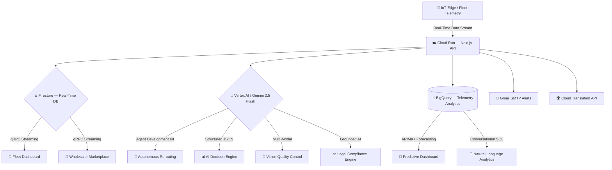

<div align="center">
  
  
  <br/>
  <br/>
  
  <h1>🏔️ Annapurna Logistics</h1>
  
  <h3>Autonomous Multi-Agent AI · Emergency Cargo Rescue · Real-Time Cold-Chain Intelligence</h3>
  
  <p>
    <strong>Built for Google Cloud Gen AI Academy APAC · Cohort 2</strong><br>
    <em>Minimizing waste. Maximizing efficiency. Saving the harvest.</em>
  </p>
  
  <p>
    <a href="https://annapurna-web-887568501843.us-central1.run.app" target="_blank"></a>
    <a href="https://github.com/sumitsaraswat362/Annapurna-Gemini-APAC"></a>
  </p>

  <p>
    
    
    
    
    
    
    
  </p>

  <p>
    <a href="#-the-15-lakh-crore-crisis">The Problem</a> •
    <a href="#-our-autonomous-solution">Our Solution</a> •
    <a href="#-google-cloud-services--live-integrations">Google Cloud Stack</a> •
    <a href="#-key-platform-features">Features</a> •
    <a href="#-architecture">Architecture</a> •
    <a href="#-security--guardrails">Security</a> •
    <a href="#-screenshots">Screenshots</a>
  </p>
</div>

---

## 💔 The ₹1.5 Lakh Crore Crisis

Every year, India loses over **₹1.5 Lakh Crore (US$18 Billion)** to food wastage. The primary culprit? **Broken, fragmented logistics and compromised cold-chain integrity.**

> **40% of India's perishable food production is wasted before it reaches the consumer.**

Traditional logistics fleets operate with critical blind spots. By the time a refrigeration compressor fails on a transport truck, the damage is already done — the cargo spoils, the farmer loses their livelihood, and the wholesaler receives nothing. The current market relies on **reactive telematics** — telling managers a truck *has already broken down*, when it is already too late.

---

## 💡 Our Autonomous Solution

**Annapurna** is not just another dashboard. It is an **autonomous, multi-agent AI logistics ecosystem** designed to eradicate food waste in transit.

By combining real-time IoT telemetry with a **Gemini 2.5 Flash-powered Multi-Agent Orchestration** system, Annapurna continuously monitors environmental conditions across the entire fleet. The moment our system detects a cooling failure or anomaly, our AI **autonomously**:

1. 🧠 **Analyzes** — Runs predictive spoilage models to calculate the exact time-to-spoil window
2. 🔀 **Reroutes** — Calculates optimal emergency reroutes to the nearest cold storage or wholesale market
3. 📢 **Broadcasts** — Opens an emergency marketplace, alerting nearby wholesalers of discounted distress cargo
4. 💰 **Negotiates** — AI agents autonomously negotiate fair pricing between fleet operators and buyers
5. ⚖️ **Validates** — AI Legal Assistant, grounded in FSSAI regulations, checks compliance in real-time
6. 📧 **Notifies** — Dispatches multilingual alerts via email to all stakeholders
7. 🌍 **Recovers** — Live ESG tracking of total food saved, economic value recovered, and CO2 prevented

**Zero human intervention required. Fully autonomous. End-to-end.**

---

## ⚡ GOOGLE CLOUD POWER STACK

Annapurna is built **100% on Google Cloud**, deeply integrating **9 different services** to create a fully autonomous decision engine. This isn't just a dashboard — it's an AI that ACTS.

| # | Service | What It Does in Annapurna | What Would Break Without It |
|---|---|---|---|
| 1 | **Vertex AI (Gemini 2.5 Flash)** | Powers ALL AI reasoning — autonomous routing, negotiation, vision QC, document extraction, text-to-SQL, legal RAG, voice intent extraction, and metrics. | No autonomous intelligence. Just a static dashboard with manual decisions. |
| 2 | **Google ADK (Agent Development Kit)** | Powers our `fleet_decision_agent`. Uses `FunctionTool` bindings to autonomously call `reroute_truck()` and `alert_wholesaler()`, executing real Firestore writes. | AI could only "suggest" — never act. The entire autonomy claim collapses. |
| 3 | **Cloud Firestore** | Real-time state engine. `onSnapshot` listeners give instant cross-dashboard sync. Uses atomic batch writes for processing wholesaler bids to prevent race conditions. | No real-time collaboration. Wholesalers would need to manually refresh. Bid races would corrupt data. |
| 4 | **Firestore Native Vector Search** | Legal RAG pipeline: retrieves relevant FSSAI food safety documents using `findNearest()` with `COSINE` distance. | Would require external vector databases (Pinecone/Weaviate) — breaking the 100% Google Cloud architecture. |
| 5 | **Vertex AI Text Embeddings** | Uses `text-embedding-004` (task type `RETRIEVAL_QUERY`) to convert user legal queries into vectors for Firestore Vector Search. | No semantic understanding of legal queries. Keyword matching only, leading to poor legal advice. |
| 6 | **BigQuery & BigQuery ML** | Petabyte-scale telemetry warehouse + ARIMA_PLUS spoilage forecasting. Model trains and serves predictions inside BigQuery. Gemini text-to-SQL agent lets managers query data in plain English. | No predictive intelligence. No natural language analytics. Fleet managers couldn't query their own data easily. |
| 7 | **Cloud Run** | Production deployment. Auto-scaling containerized Next.js 15 app (2 vCPU, 2GB RAM). Scales from 0 to 1000+ instances instantly. | App would only work on localhost. No live demo. No global access. No scalability proof. |
| 8 | **Cloud Translate API** | Multi-language JAPAC support: Hindi, Japanese, Thai, Bahasa, Vietnamese. One API call for any language pair. | Platform would be English-only. Unusable in diverse JAPAC markets. |
| 9 | **Generative AI SDK (v2.12)** | Unified AI client. Smart proxy pattern auto-detects API key vs Vertex AI service account. Single entry point for all 8 Gemini AI capabilities. | Would require 8 separate SDK integrations, creating a fragmented and unmaintainable AI layer. |

---

### 📈 By the Numbers:
- **9** Google Cloud Services (deeply integrated)
- **8** Distinct Gemini AI Capabilities
- **5** Autonomous AI Agents (ADK + Gemini)
- **13** Server-Side API Routes
- **4** Data Input Modalities (IoT, Camera, Documents, Voice)
- **14** Days of predictive spoilage forecasting (ARIMA_PLUS)
- **<90 Seconds** from cold-chain failure to completed emergency sale
- **85%** Cargo value recovered (vs 0% industry standard)

---

## 🚀 Key Platform Features

### 🧠 Autonomous Nerve Center
Watch AI agents communicate in real-time. **MonitorAgent**, **DecisionAgent**, and **NotificationAgent** orchestrate your entire supply chain without human intervention, powered by Google's **Agent Development Kit (ADK)**. See every decision and autonomous action as it happens.

### 📊 Fleet Dashboard & Live Map
Monitor thousands of vehicles with pinpoint GPS accuracy on interactive Leaflet maps. Real-time telemetry streaming shows temperature, humidity, ethylene levels, and ETA for every truck in your fleet.

### 🌡️ Cold-Chain Integrity Monitoring
AI-powered temperature anomaly detection with predictive alerts. When a cooling unit shows early signs of failure, the system triggers autonomous rerouting protocols before the cargo spoils.

### 🏪 Emergency Wholesaler Marketplace
A revolutionized B2B marketplace. When cargo enters distress, nearby wholesalers are instantly notified and can bid to purchase the endangered load at a fair, AI-negotiated price — saving both the cargo and the farmer's revenue.

### 📈 Conversational Analytics (BigQuery)
Ask your fleet questions in plain English: *"What was the average temperature of seafood shipments last week?"* Gemini generates SQL, executes it against BigQuery, and returns instant visual charts.

### 🔮 Predictive Forecasting (ARIMA+)
BigQuery ML's ARIMA+ forecasting model predicts spoilage risk windows 14 days in advance, enabling proactive fleet scheduling and preventive maintenance.

### 📸 Vision AI Quality Control
Multi-modal cargo inspection at delivery checkpoints. Drivers upload photos; Gemini Vision scans and grades the shipment quality, detecting spoilage, rot, or contamination automatically.

### ⚖️ AI Legal Assistant
AI-powered legal compliance. Grounded directly in relevant FSSAI food safety regulations, it generates comprehensive liability analysis reports to assist with dispute resolution.

### 🗣️ Voice Interface
Hands-free fleet management using browser-native speech recognition + Gemini NLU. Fleet managers can issue voice commands while on the move.

### 🌍 Multilingual Support
Full vernacular localization via Google Cloud Translation API. Agent logs, alerts, and notifications are translated into Hindi, Marathi, Tamil, and Telugu — serving India's diverse workforce.

### 🌿 Sustainability Dashboard
Track and reduce your fleet's carbon footprint. AI-optimized routes minimize fuel consumption and emissions, contributing to a greener supply chain.

---

## 🏗️ Architecture

Annapurna runs on a fully **Google Cloud-native** serverless architecture via **Cloud Run**, with **Firestore** for real-time state synchronization and the **Vertex AI** ecosystem for all intelligence.



### Tech Stack at a Glance

| Layer | Technology |
|---|---|
| **Frontend** | Next.js 16, React 19, Tailwind CSS 4, Framer Motion, Recharts, Leaflet Maps |
| **AI Engine** | Vertex AI, Gemini 2.5 Flash, Gemini Vision, Agent Development Kit (ADK) |
| **Database** | Google Cloud Firestore (real-time gRPC streaming) |
| **Analytics** | Google BigQuery, BigQuery ML (ARIMA+ forecasting) |
| **Deployment** | Google Cloud Run (containerized Docker), Cloud Build CI/CD |
| **Localization** | Google Cloud Translation API (Hindi, Marathi, Tamil, Telugu) |
| **Notifications** | Nodemailer + Gmail SMTP |

---

## 🛡️ Security & Guardrails

Annapurna implements **enterprise-grade security** to prevent unauthorized access and data corruption:

| Security Layer | Implementation |
|---|---|
| **Firestore Rules** | `allow write: if false` — All client-side writes are completely blocked. Database mutations only occur through server-side Admin SDK endpoints. |
| **Server-Mediated Writes** | All state changes (bids, cargo updates, deletions) are routed through authenticated Next.js API routes (`/api/firestore`) using the GCP Admin SDK. |
| **SQL Injection Prevention** | Only `SELECT` statements are executed against BigQuery. All queries are parameterized and scoped. |
| **Dataset Restriction** | BigQuery queries are restricted exclusively to the `annapurna_telemetry` dataset. |
| **Row Caps** | Query results capped at 100 rows to prevent data exfiltration. |
| **API Key Architecture** | Firebase API keys are public identifiers (by Google's design). All sensitive operations use server-side Application Default Credentials. |
| **Graceful Degradation** | All AI features fall back to deterministic logic if APIs are unavailable, ensuring zero downtime. |

---

## 🗺️ Roadmap — Future Enhancements

| Enhancement | Description |
|---|---|
| **Document AI** | Dedicated Document AI processor for invoice OCR (currently handled by Gemini Vision) |
| **Dialogflow CX** | Production voice interface agent (currently using browser SpeechRecognition + Gemini NLU) |

---

## 📸 Screenshots

<div align="center">
  
  
  
  
  
  
  
  
  
  
  
  
</div>

---

## 🏃 Getting Started

```bash
# Clone the repository
git clone https://github.com/sumitsaraswat362/Annapurna-Gemini-APAC.git
cd Annapurna-Gemini-APAC

# Install dependencies
npm install

# Set up environment variables
cp .env.example .env.local
# Add your GEMINI_API_KEY, GCP_PROJECT_ID, BIGQUERY credentials

# Run locally
npm run dev

# Deploy to Cloud Run
gcloud run deploy annapurna-web --source . --region us-central1 --allow-unauthenticated
```

---

<div align="center">
  <h3>🏔️ Ready to revolutionize your supply chain?</h3>
  <p>Join industry leaders in minimizing waste and maximizing efficiency with Annapurna's autonomous AI logistics platform — built entirely on Google Cloud.</p>
  
  <br/>
  
  <a href="https://annapurna-web-887568501843.us-central1.run.app" target="_blank">
    
  </a>
  
  <br/><br/>
  
  <sub>Built with ❤️ for Google Cloud Gen AI Academy APAC · Cohort 2</sub>
</div>
