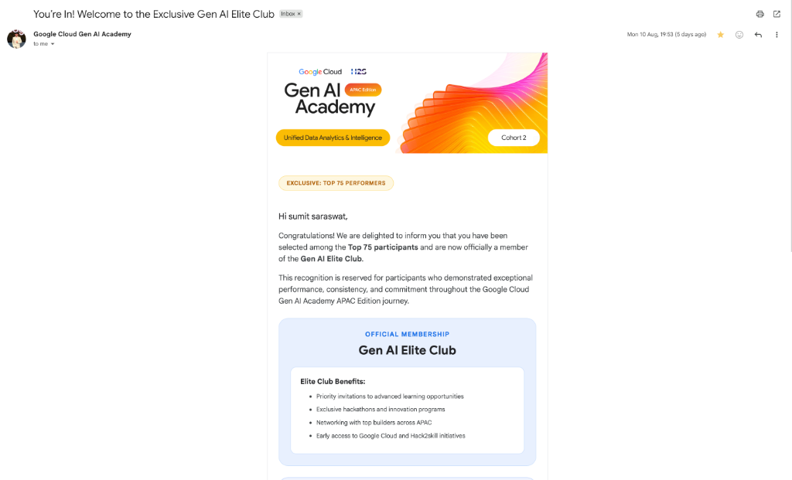
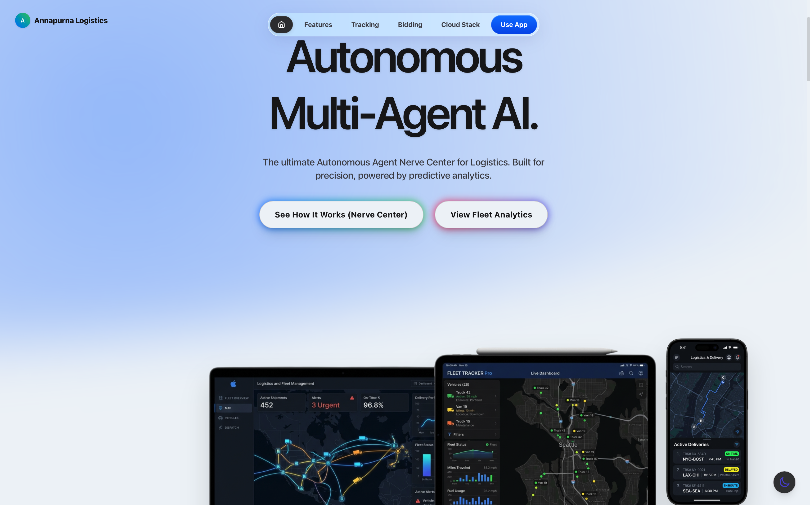
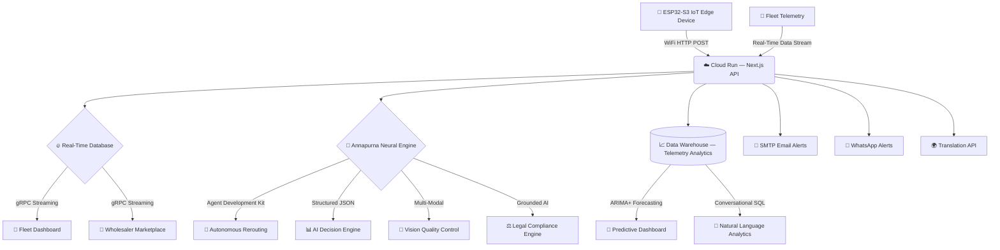
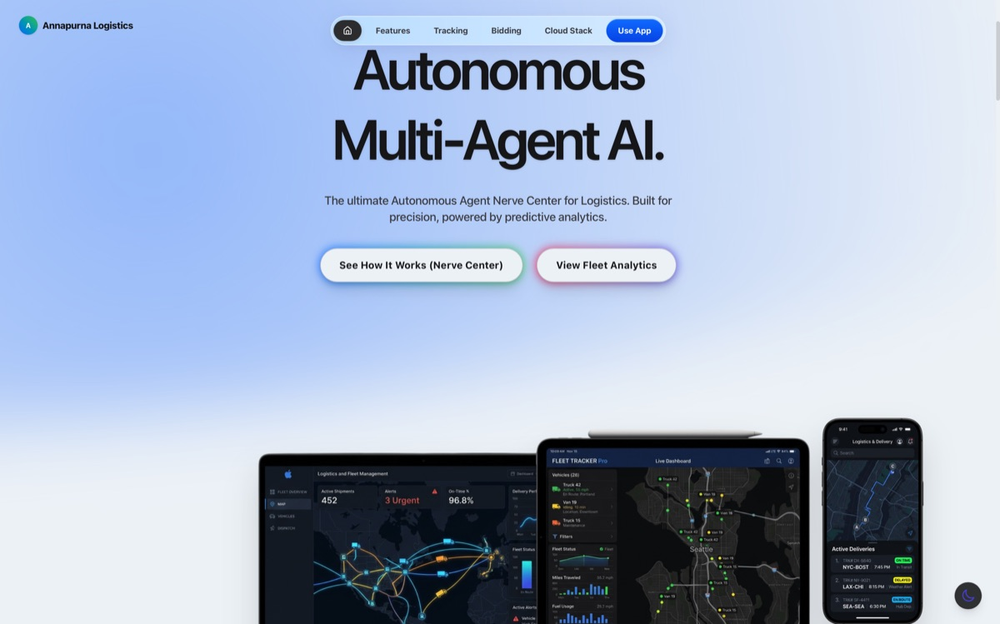
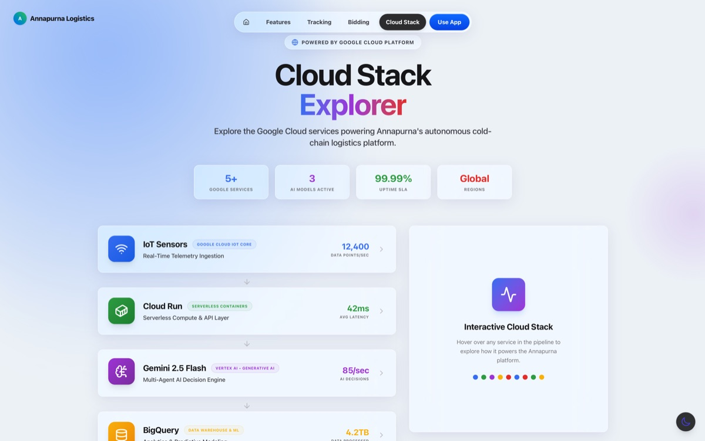
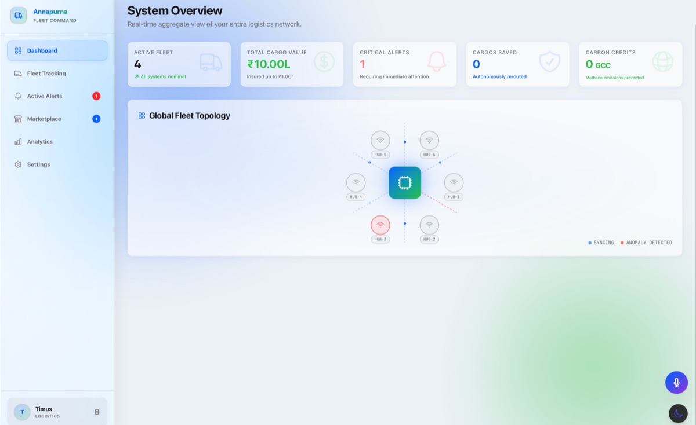
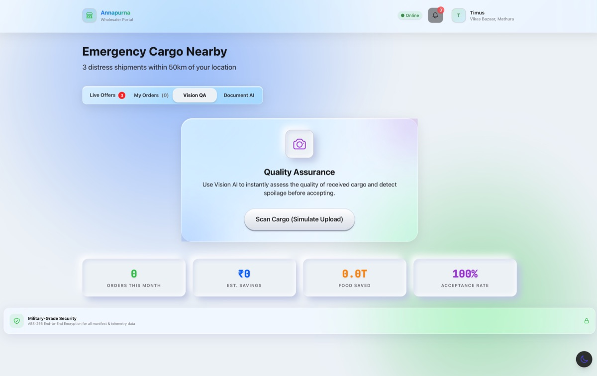
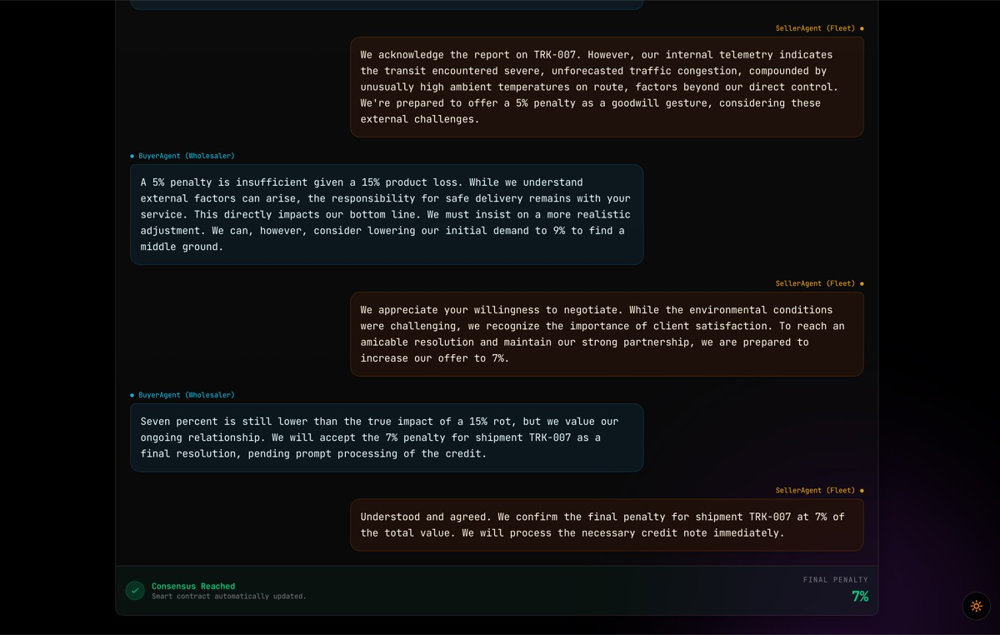
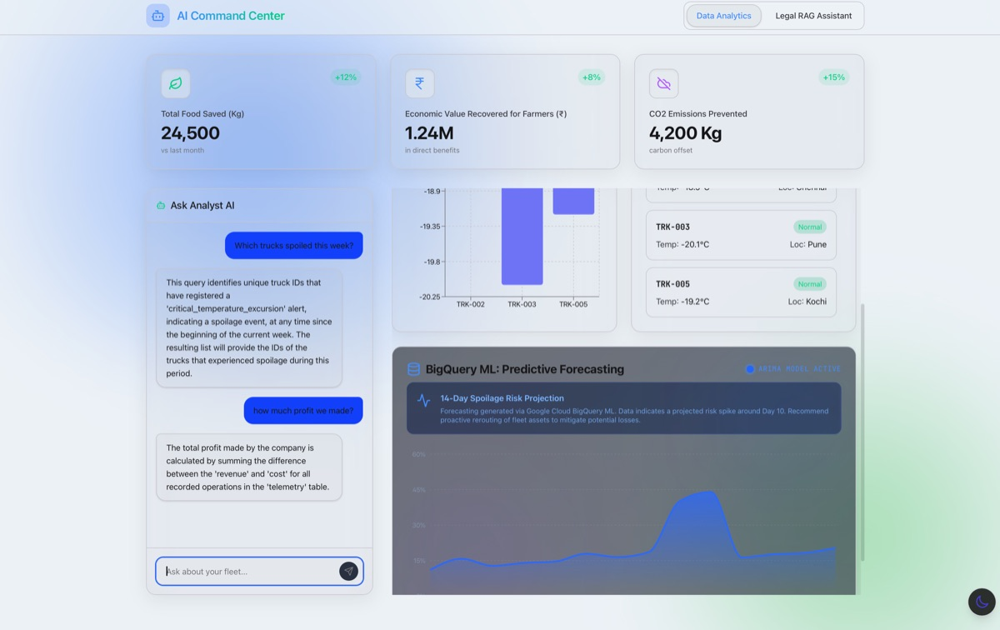

<div align="center">

  <!-- 🏆 RECOGNITION BANNER -->
  <a href="https://cloud.google.com/blog/topics/training-certifications/gen-ai-academy">
    
  </a>
  <br/>
  <a href="https://cloud.google.com/blog/topics/training-certifications/gen-ai-academy">
    
  </a>
  <br/>
  <sub><b>Selected: Top 75 out of 196,000+ developers across 12 Asia-Pacific nations</b><br/>(India · Singapore · Japan · China · Malaysia · Indonesia · Australia · South Korea · Thailand · Philippines · Vietnam · New Zealand)</sub>
  <br/><br/>
  

  <br/>
  <br/>

  
  
  <br/>
  <br/>
  
  <h1>🏔️ Annapurna Logistics</h1>
  
  <h3>Autonomous Multi-Agent AI · Emergency Cargo Rescue · Real-Time Cold-Chain Intelligence</h3>
  
  <p>
    <em>Minimizing waste. Maximizing efficiency. Saving the harvest.</em>
  </p>
  
  <p>
    <a href="https://annapurna-887568501843.us-central1.run.app"></a>
    <a href="https://youtu.be/oO7NOoUSecg?si=46-VzlLp134Hv9jH"></a>
    <a href="https://github.com/sumitsaraswat362/Annapurna-Gemini-APAC"></a>
  </p>

  <p>
    <a href="https://annapurna-887568501843.us-central1.run.app"><strong>🌐 Live App: https://annapurna-887568501843.us-central1.run.app</strong></a>
    <br/>
    <a href="https://youtu.be/oO7NOoUSecg?si=46-VzlLp134Hv9jH"><strong>📺 Demo Video: https://youtu.be/oO7NOoUSecg</strong></a>
  </p>

  <p>
    
    
    
    
    
  </p>

  <p>
    <a href="#-the-15-lakh-crore-crisis">The Problem</a> •
    <a href="#-our-autonomous-solution">Our Solution</a> •
    <a href="#-iot-hardware-prototype">IoT Hardware</a> •
    <a href="#-ai-engine--capabilities">AI Engine</a> •
    <a href="#-key-platform-features">Features</a> •
    <a href="#-architecture">Architecture</a> •
    <a href="#-security--guardrails">Security</a> •
    <a href="#-screenshots">Screenshots</a>
  </p>
</div>

---

## 💔 The ₹1.5 Lakh Crore Crisis

Every year, India loses over **₹1.5 Lakh Crore (US$18 Billion)** to food wastage. The primary culprit? **Broken, fragmented logistics and compromised cold-chain integrity.**

> **40% of India's perishable food production is wasted before it reaches the consumer.**

Traditional logistics fleets operate with critical blind spots. By the time a refrigeration compressor fails on a transport truck, the damage is already done — the cargo spoils, the farmer loses their livelihood, and the wholesaler receives nothing. The current market relies on **reactive telematics** — telling managers a truck *has already broken down*, when it is already too late.

---

## 💡 Our Autonomous Solution

**Annapurna** is not just another dashboard. It is an **autonomous, multi-agent AI logistics ecosystem** designed to eradicate food waste in transit.

By combining real-time IoT telemetry from custom hardware with a **Multi-Agent AI Orchestration** system, Annapurna continuously monitors environmental conditions across the entire fleet. The moment our system detects a cooling failure or anomaly, our AI **autonomously**:

1. 🧠 **Analyzes** — Runs predictive spoilage models to calculate the exact time-to-spoil window
2. 🔀 **Reroutes** — Calculates optimal emergency reroutes to the nearest cold storage or wholesale market
3. 📢 **Broadcasts** — Opens an emergency marketplace, alerting nearby wholesalers of discounted distress cargo
4. 💰 **Negotiates** — AI agents autonomously negotiate fair pricing between fleet operators and buyers
5. ⚖️ **Validates** — AI Legal Assistant, grounded in FSSAI regulations, checks compliance in real-time
6. 📧 **Notifies** — Dispatches multilingual alerts via email to all stakeholders
7. 🌍 **Recovers** — Live ESG tracking of total food saved, economic value recovered, and CO2 prevented

**Zero human intervention required. Fully autonomous. End-to-end.**

---

## 🔌 IoT Hardware Prototype

Annapurna includes a **physical IoT edge device** built on the **ESP32-S3 microcontroller** with on-device ML for real-time anomaly detection at the source.

### Hardware Stack

| Component | Purpose |
|---|---|
| **ESP32-S3-WROOM-N16R8** | Dual-core MCU with WiFi + BLE, 16MB Flash, 8MB PSRAM |
| **DHT22** | Precision temperature & humidity monitoring |
| **MQ-135** | Air quality / ethylene gas detection (spoilage indicator) |
| **GY-30 (BH1750)** | Light intensity sensor (detects container breach) |
| **ADXL345** | 3-axis accelerometer (detects drops, rough handling) |
| **SSD1306 OLED (128x64)** | Live dashboard displaying all sensor data |
| **Active Buzzer** | Audible alarm on anomaly detection |

### Edge ML Features

- **Z-Score Anomaly Detection:** Continuously calculates rolling mean and standard deviation across a 30-sample window for each sensor. Triggers alerts when readings deviate beyond 2.5σ from the learned baseline.
- **I2C Hot-Swap Architecture:** Manages 3 I2C devices across 2 hardware I2C buses using dynamic bus reassignment — allowing every sensor to have its own dedicated data pins without a multiplexer.
- **Auto-Detection:** Automatically scans both possible I2C addresses (0x53/0x1D for accelerometer, 0x23/0x5C for light sensor) during boot.
- **Real-Time WiFi Uplink:** Streams JSON telemetry payloads to the cloud API via HTTP POST over WiFi.

### Annapurna OS v2.0 (Firmware)

The ESP32 runs a custom C++ firmware called **Annapurna OS** featuring:
- Boot animation with system diagnostic progress bar
- 3 auto-cycling OLED screens: Live Dashboard, ML Brain Status, Network Info
- Flashing triple-border WARNING screen on anomaly detection
- Cold-chain specific rules: Temperature > 35°C, Gas > 2500, sudden drops/light breaches

---

## 🧠 AI Engine & Capabilities

Annapurna's intelligence layer, the **Neural Engine**, powers all AI reasoning across the platform:

| # | Capability | What It Does |
|---|---|---|
| 1 | **Multi-Agent Orchestration** | MonitorAgent → DecisionAgent → NotificationAgent chain. AI is the PRIMARY decision maker, not just a narrator. |
| 2 | **Agent Development Kit (ADK)** | `fleet_decision_agent` uses `FunctionTool` bindings to autonomously call `reroute_truck()` and `alert_wholesaler()`, executing real database writes. |
| 3 | **Conversational Analytics** | Text-to-SQL agent lets managers query telemetry data in plain English and get instant visual charts. |
| 4 | **ARIMA+ Forecasting** | ML forecasting model predicts spoilage risk windows 14 days in advance. |
| 5 | **Vision AI Quality Control** | Multi-modal cargo inspection. Drivers upload photos; AI scans and grades shipment quality automatically. |
| 6 | **Legal RAG Assistant** | Retrieval-Augmented Generation grounded in FSSAI Act 2006 & FSS Rules 2011 for real-time compliance analysis. |
| 7 | **Voice Interface** | Hands-free fleet management via browser-native speech recognition + NLU intent extraction. |
| 8 | **Document AI** | OCR extraction from driver manifests, invoices, and compliance documents. |

### 📈 By the Numbers:
- **8** Distinct AI Capabilities
- **5** Autonomous AI Agents
- **18** Server-Side API Routes
- **10+** Filter Criteria
- **Real-time** AI Negotiation
- **5** Physical IoT Sensors
- **4** Data Input Modalities (IoT, Camera, Documents, Voice)
- **14** Days of predictive spoilage forecasting (ARIMA+)
- **<90 Seconds** from cold-chain failure to completed emergency sale
- **85%** Cargo value recovered (vs 0% industry standard)

---

## 🚀 Key Platform Features

### 🧠 Autonomous Nerve Center
Watch AI agents communicate in real-time. **MonitorAgent**, **DecisionAgent**, and **NotificationAgent** orchestrate your entire supply chain without human intervention using the **Agent Development Kit (ADK)**. See every decision and autonomous action as it happens.

### 📊 Fleet Dashboard & Live Map
Monitor thousands of vehicles with pinpoint GPS accuracy on interactive Leaflet maps. Real-time telemetry streaming shows temperature, humidity, ethylene levels, and ETA for every truck in your fleet.

### 🌡️ Cold-Chain Integrity Monitoring & Smart Rerouting
AI-powered temperature anomaly detection with predictive alerts. When a cooling unit shows early signs of failure, the system triggers autonomous rerouting protocols (using Haversine distance and a 50km radius) to the nearest cold storage or wholesaler before the cargo spoils.

### 🏪 Emergency Wholesaler Marketplace & AI Negotiation
A revolutionized B2B marketplace. When cargo enters distress, nearby wholesalers are instantly notified and can bid to purchase the endangered load. The platform features **Real-time AI Negotiation** (a 3-round counter-offer system via Gemini) to ensure fair pricing, saving both the cargo and the farmer's revenue. 

### 🔍 Advanced Multi-Criteria Search & Filter
Wholesalers can filter distress cargo using 10+ criteria, including telemetry (temp, humidity, ethylene), geographic distance, temporal factors, price range, and multi-status toggles. Includes an **AI Smart Filter** with natural language parsing, **CSV Export** for filtered data, and **Saved Filter Templates** via localStorage.

### 💬 Real-time Chat & AI Help Bot
Firestore-backed real-time messaging allows wholesalers to chat directly with fleet managers when human intervention is needed. A floating Gemini-powered **AI Help Bot** is available on every page for instant assistance.

### 📱 Multi-Channel Alerts
Stakeholders are instantly notified of IoT emergencies via **Real Email Notifications** (Gmail SMTP via Nodemailer) and **WhatsApp Notifications** (Twilio integration).

### 📈 Conversational Analytics
Ask your fleet questions in plain English: *"What was the average temperature of seafood shipments last week?"* The AI generates SQL, executes it against the data warehouse, and returns instant visual charts.

### 🔮 Predictive Forecasting (ARIMA+)
ML forecasting model predicts spoilage risk windows 14 days in advance, enabling proactive fleet scheduling and preventive maintenance.

### 📸 Vision AI Quality Control
Multi-modal cargo inspection at delivery checkpoints. Drivers upload photos; Annapurna Vision AI scans and grades the shipment quality, detecting spoilage, rot, or contamination automatically.

### ⚖️ AI Legal Assistant
AI-powered legal compliance. Grounded directly in relevant FSSAI food safety regulations, it generates comprehensive liability analysis reports to assist with dispute resolution.

### 🗣️ Voice Interface
Hands-free fleet management using browser-native speech recognition + NLU. Fleet managers can issue voice commands while on the move.

### 🌍 Multilingual Support
Full vernacular localization via Cloud Translation API. Agent logs, alerts, and notifications are translated into Hindi, Marathi, Tamil, and Telugu — serving India's diverse workforce.

### 🌿 Sustainability Dashboard
Track and reduce your fleet's carbon footprint. AI-optimized routes minimize fuel consumption and emissions, contributing to a greener supply chain.

---

## 🏗️ Architecture

Annapurna runs on a fully **cloud-native** serverless architecture with real-time database synchronization and an AI-first intelligence layer.


```mermaid
graph TD
    Z[🔌 ESP32-S3 IoT Edge Device] -->|WiFi HTTP POST| B
    A[🚛 Fleet Telemetry] -->|Real-Time Data Stream| B(☁️ Cloud Run — Next.js API)
    B --> C{🔥 Real-Time Database}
    C -->|gRPC Streaming| D[📱 Fleet Dashboard]
    C -->|gRPC Streaming| E[🏪 Wholesaler Marketplace]
    B --> F{🧠 Annapurna Neural Engine}
    F -->|Agent Development Kit| G[🔀 Autonomous Rerouting]
    F -->|Structured JSON| H[📊 AI Decision Engine]
    F -->|Multi-Modal| I[📸 Vision Quality Control]
    B --> J[(📈 Data Warehouse — Telemetry Analytics)]
    J -->|ARIMA+ Forecasting| K[🔮 Predictive Dashboard]
    J -->|Conversational SQL| L[💬 Natural Language Analytics]
    B --> M[📧 SMTP Email Alerts]
    B --> P[📱 WhatsApp Alerts]
    B --> N[🌍 Translation API]
    F -->|Grounded AI| O[⚖️ Legal Compliance Engine]
```

### Tech Stack at a Glance

| Layer | Technology |
|---|---|
| **Frontend** | Next.js 16, React 19, Tailwind CSS 4, Framer Motion, Recharts, Leaflet Maps |
| **AI Engine** | Annapurna Neural Engine, Vision AI, Agent Development Kit (ADK) |
| **Database** | Firestore (real-time gRPC streaming) |
| **Analytics** | Data Warehouse, ML Forecasting (ARIMA+) |
| **IoT Hardware** | ESP32-S3, DHT22, MQ-135, GY-30, ADXL345, SSD1306 OLED |
| **Edge ML** | Z-Score Anomaly Detection, I2C Hot-Swap Architecture |
| **Deployment** | Cloud Run (containerized Docker), CI/CD |
| **Localization** | Cloud Translation API (Hindi, Marathi, Tamil, Telugu) |
| **Notifications** | Nodemailer (SMTP), Twilio (WhatsApp) |

---

## 🛡️ Security & Guardrails

Annapurna implements **enterprise-grade security** to prevent unauthorized access and data corruption:

| Security Layer | Implementation |
|---|---|
| **Database Rules** | `allow write: if false` — All client-side writes are completely blocked. Database mutations only occur through server-side Admin SDK endpoints. |
| **Server-Mediated Writes** | All state changes (bids, cargo updates, deletions) are routed through authenticated Next.js API routes using the Admin SDK. |
| **SQL Injection Prevention** | Only `SELECT` statements are executed against the data warehouse. All queries are parameterized and scoped. |
| **Dataset Restriction** | Queries are restricted exclusively to the `annapurna_telemetry` dataset. |
| **Row Caps** | Query results capped at 100 rows to prevent data exfiltration. |
| **API Key Architecture** | API keys are public identifiers. All sensitive operations use server-side Application Default Credentials. |
| **Graceful Degradation** | All AI features fall back to deterministic logic if APIs are unavailable, ensuring zero downtime. |

---

## 🗺️ Roadmap — Future Enhancements

| Enhancement | Description |
|---|---|
| **Dedicated Document AI Processor** | Production-grade invoice OCR with dedicated processor pipeline |
| **Production Voice Agent** | Full conversational voice interface agent for hands-free operations |
| **Fleet GPS Hardware Module** | NEO-6M GPS integration for real-time location tracking from IoT device |

---

## 📸 Screenshots

<div align="center">
  
  
  
  
  
  
  
  
  
  
  
  
</div>

---

## 🏃 Getting Started

```bash
# Clone the repository
git clone https://github.com/sumitsaraswat362/Annapurna.git
cd Annapurna

# Install dependencies
npm install

# Set up environment variables
cp .env.example .env.local
# Add your API keys and project credentials

# Run locally
npm run dev

# Deploy to Cloud Run
gcloud run deploy annapurna-web --source . --region us-central1 --allow-unauthenticated
```

---

<div align="center">
  <h3>🏔️ Ready to revolutionize your supply chain?</h3>
  <p>Join industry leaders in minimizing waste and maximizing efficiency with Annapurna's autonomous AI logistics platform.</p>
  
  <br/>
  
  <sub>Built with ❤️ by Team Annapurna</sub>
</div>
